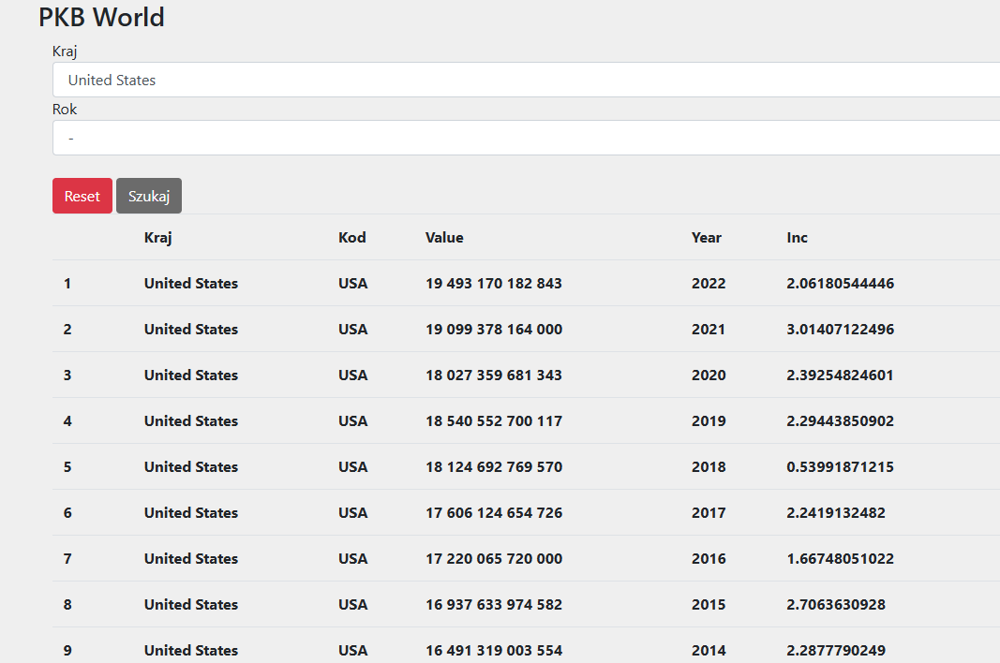

#pkbworld  
Tutaj będzie projekt w Laravelu dotyczący datych związanych z PKB w celu badań nad pkb świata

Dane będą pobrane z pliku csv  
curl -L "https://ourworldindata.org/grapher/gdp-maddison-project-database.csv?v=1&csvType=full&useColumnShortNames=false" -o gdp_swiata_maddison.csv  

 

 Dodatkowo uzyję rankingów global - 500 z tej strony https://github.com/cmusam/fortune500, tam są csv-ki